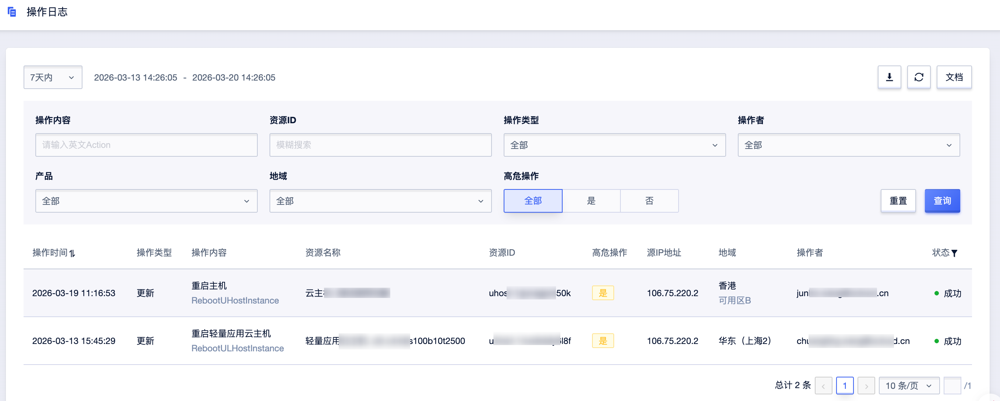

  
# 操作指南
本文主要介绍 ULog的使用。

## 日志查询与筛选
您可以通过多维度组合筛选，精准定位目标操作日志。
### 按时间范围查询
进入「操作日志」页面，在页面顶部时间选择器中，选择预设时间范围（如 7 天内、30 天内）或自定义起止时间，点击「查询」加载对应时间段的操作日志
### 按条件筛选
在筛选栏中，您可组合以下条件进行精准查询：

- **操作内容**：支持输入英文 Action（如 `RebootULHostInstance`）进行检索。
- **资源 ID**：输入目标资源 ID 即可实现精准搜索，快速定位关联该资源的所有操作。
- **操作类型**：可筛选「创建」「更新」「删除」特定类型的操作，缩小查询范围。
- **操作者**：按子用户、角色等身份维度过滤操作记录，便于追溯操作责任人。
- **产品**：筛选特定云产品的操作日志，聚焦目标业务线的操作行为。
- **地域**：按资源所在地域过滤，满足多地域部署场景下的审计需求。
- **高危操作**：可选择「是」「否」「全部」，快速识别并聚焦重启、删除、配置变更等可能影响业务连续性的高危操作。

### 日志列表查看
筛选后，日志列表将展示以下核心字段：
- **操作时间**：精确记录操作发生的时间点，支持按时间正序 / 倒序排列。
- **操作类型**：标记操作的核心行为类型，如「创建」「更新」「删除」等。
- **操作内容**：展示操作的中文名称及对应的英文 Action，便于技术侧快速识别操作行为。
- **资源名称 / ID**：呈现被操作云资源的名称与唯一 ID，明确操作影响对象。
- **高危操作**：以标签形式标记该操作是否为高危操作，辅助安全审计。
- **源 IP 地址**：记录操作发起的 IP 地址，用于定位操作来源。
- **地域**：展示被操作资源所在的地域及可用区。
- **操作者**：显示执行操作的账号或子用户信息，明确操作责任人。
- **状态**：直观展示操作执行结果（成功 / 失败），便于快速排查问题。

### 日志导出
完成筛选后，点击页面右上角「下载」按钮
系统将生成 CSV 格式的日志文件
下载后可用于本地分析、合规存档或进一步处理
